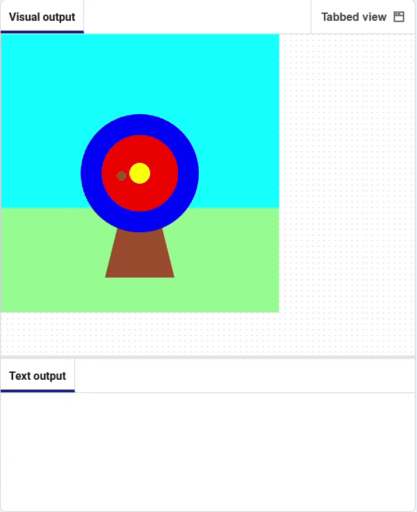

## What colour did you hit?

Next, you will add some code to get the colour at the location of the arrow.

### Get the colour hit by the arrow

--- task ---

Exiba uma mensagem **if** a `cor_acerto` for igual à cor dos `círculos` externos (azul) 🎯.

Add code to `get` the colour at the centre of the arrow ,and store it in the `hit_colour` variable.

--- code ---
---
language: python filename: main.py - mouse_pressed() line_numbers: true line_number_start: 6
line_highlights: 7
---
def mouse_pressed(): if cor_acerto == Color('blue').hex:   
print('Você acertou o círculo externo, 50 pontos!') elif cor_acerto == Color('red').hex: print('Você acertou o círculo interno, 200 pontos!') elif cor_acerto == Color('yellow').hex: print('Você acertou o meio, 500 pontos!')

--- /code ---

**Depurar:** 🐞 Certifique-se de ter usado `.hex` para as cores dos **seus** círculos.

--- /task ---

--- task ---

**Teste:** 🔄 Execute seu projeto. **Depurar:** 🐞 Verifique se você usou a grafia americana de 'Color' (sem 'u') e se 'Color' está em maiúscula.

--- /task ---

### Run code when the mouse is pressed

--- task --- Comment out the line that prints the colour. This means it will not run.

--- code ---
---
language: python filename: main.py line_numbers: true line_number_start: 6
line_highlights: 7, 8
---

    hit_colour = get(arrow_x, arrow_y).hex
    # print(hit_colour)
    circle(arrow_x, arrow_y, 15)
--- /code ---

--- /task ---

--- task --- Add code to print the target emoji 🎯 **when the mouse is clicked**.

--- code ---
---
language: python filename: main.py line_numbers: true line_number_start: 5
line_highlights: 9-12
---
# A função mouse_pressed vai aqui
def mouse_pressed():

--- /task ---

**Teste:** 🔄 Execute seu projeto. Tente disparar a flecha nos círculos interno e do meio para ver suas mensagens.

 --- /task ---

--- save ---