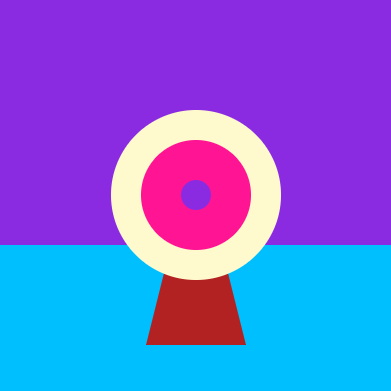

## Малювання мішені

У твоїй грі потрібно намалювати мішень, в яку можна випускати стріли.

{:width="300px"}

### Намалюй підставку у вигляді трикутника

--- task ---

Встановлення кольору заливки на `wood` (коричневий).

Намалюй трикутник, використовуючи координати x та y для кожного з кутів.

{:width="400px"}

--- code ---
---
language: python filename: main.py - draw() line_numbers: true line_number_start: 27
line_highlights: 29, 30
---

    fill('lightgreen')  # Set the fill colour for the grass to light green
    rect(0, 250, 400, 150)  # Draw a rectangle for the grass with these values for x, y, width, height
    fill('sienna')  # Brown colour
    triangle(150, 350, 200, 150, 250, 350)  # Draw a triangle for the target's stand

--- /code ---

--- /task ---

--- task ---

**Test:** 🔄 Run your code to see the stand for your target:

{:width="400px"}

--- /task ---

### Намалюй коло для мішені

--- task ---

The largest part of the target is a blue **circle**.

Найбільша частина мішені - це синє **коло**.

Встановлення кольору заливки на `outer` (синій).

{:width="400px"}

--- code ---
---
language: python filename: main.py - draw() line_numbers: true line_number_start: 20
line_highlights: 31, 32
---

    fill('sienna')  # Brown colour
    triangle(150, 350, 200, 150, 250, 350)  # Draw a triangle for the target's stand 
    fill('blue')  # Set the circle fill colour to blue
    circle(200, 200, 170)  # Draw the outer circle

--- /code ---

--- /task ---

--- task ---

**Test:** Run your code to see the first large blue circle.

The blue circle was drawn after the stand so it is in front.

{:width="400px"}

--- /task ---

The target is made of different-sized circles with the same centre coordinates (200, 200).

--- task ---

**Add** coloured circles for the inner and middle parts of the target.

--- code ---
---
Створи дві змінні з назвою `inner` та `middle`, щоб зберігати кольори для наступних елементів.
line_highlights: 24, 25
---

    fill('sienna')  # Brown colour
    triangle(150, 350, 200, 150, 250, 350)  # Draw a triangle for the target's stand 
    fill('blue')  # Set the circle fill colour to blue
    circle(200, 200, 170)  # Draw the outer circle
    fill('red')  # Set the colour for the circle fill to red
    circle(200, 200, 110)  # Draw the inner circle using x, y, width
    fill('yellow')  # Set the colour for the circle fill to yellow      
    circle(200, 200, 30)  # Draw the middle circle using x, y, width

--- /code ---

--- /task ---

--- task ---

def draw():   
# Що відбувається на кожному кадрі global wood sky = color(92, 204, 206)   
grass = color(149, 212, 122)   
wood = color(145, 96, 51)   
outer = color(0, 120, 180) # Синій    
inner = color(210, 60, 60) # Червоний    
middle = color(220, 200, 0) # Жовтий

{:width="400px"}

--- /task ---

--- task ---

**Choose:** 💭 Change any of the colours using a different colour name. You can find a list of all of the available colour names on [W3 Schools](https://www.w3schools.com/colors/colors_names.asp){:target="blank"}.

{:width="400px"}

--- collapse ---
---
line_highlights: 35, 36, 37, 38
---

--- code ---
---
fill(wood)    
triangle(150, 350, 200, 150, 250, 350)  
fill(outer)   
circle(200, 200, 170) fill(inner) # Встановлення кольору заливки кола на inner      
circle(200, 200, 110) # Внутрішнє коло - x, y, ширина кола  
fill(middle) # Встановлення кольору заливки кола на middle      
circle(200, 200, 30) # Середнє коло - x, y, ширина кола
line_highlights:
---

def draw():
# Things to do in every frame

    fill('BlueViolet')
    rect(0, 0, 400, 250)  # Sky
    fill('DeepSkyBlue')
    rect(0, 250, 400, 150)  # Ground
    fill('FireBrick')
    triangle(150, 350, 200, 150, 250, 350)  # Stand
    fill('LemonChiffon')
    circle(200, 200, 170)  # Outer circle
    fill('DeepPink')
    circle(200, 200, 110)  # Inner circle
    fill('BlueViolet')
    circle(200, 200, 30)  # Middle circle

--- /code ---

--- /collapse ---

--- /task ---

--- save ---
