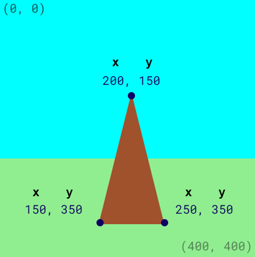
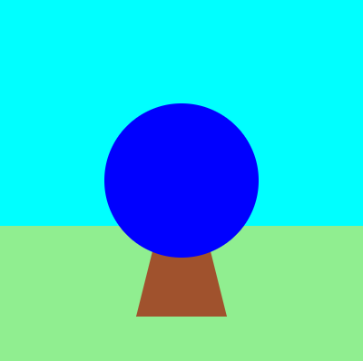

## Намалюй мішень

У твоїй грі потрібно намалювати мішень, в яку можна випускати стріли.

{:width="300px"}

### Намалюй підставку у вигляді трикутника

--- task ---

Встанови колір заливки `brown` (коричневий).

Намалюй трикутник (англійською triangle), використовуючи координати x та y для кожного з кутів.

{:width="400px"}

--- code ---
---
language: python line_numbers: true line_number_start: 21
line_highlights: 23-24
---

    fill('lightgreen')  
    rect(0, 250, 400, 150)  
    fill('brown') 
    triangle(150, 350, 200, 150, 250, 350)

--- /code ---

--- /task ---

--- task ---

**Протестуй:** запусти код, щоб побачити підставку для мішені:

{:width="400px"}

--- /task ---

### Намалюй кола мішені

--- task ---

Найбільша частина мішені — це синє **коло** (англійською circle).

Встанови колір заливки `blue` (синій).

Намалюй коло з координатами x та y (де буде його центр) та шириною.

{:width="400px"}

--- code ---
---
language: python line_numbers: true line_number_start: 23
line_highlights: 25-26
---

    fill('brown')  
    triangle(150, 350, 200, 150, 250, 350)  
    fill('blue')  
    circle(200, 200, 170)

--- /code ---

--- /task ---

--- task ---

**Протестуй:** запусти код, щоб побачити перше велике синє коло.

Ми намалювали синє коло після підставки, тому воно знаходиться попереду.

{:width="400px"}

--- /task ---

Мішень складається з кіл різного розміру з однаковими координатами центру (200, 200).

--- task ---

**Додай** кольорові кола для внутрішньої та центральної частин мішені.

--- code ---
---
language: python line_numbers: true line_number_start: 25
line_highlights: 27-30
---

    fill('blue')  
    circle(200, 200, 170)  
    fill('red')  
    circle(200, 200, 110)  # Draw the inner circle 
    fill('yellow')       
    circle(200, 200, 30)  # Draw the middle circle

--- /code ---

--- /task ---

--- task ---

**Протестуй:** запусти свій проєкт, щоб побачити мішень з трьома кольоровими колами.

{:width="400px"}

--- /task ---

--- save ---
