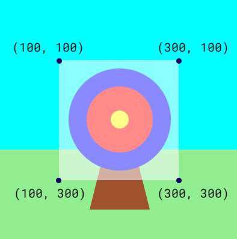

## Пусти стрілу

Коли ти будеш натискати або торкатися, стріла буде вистрілювати в місці розташування рухомого круга-мішені. 

{:width="300px"}

### Намалюй коло для мішені для кожного кадра

 Комп'ютери створюють ефект руху, показуючи зображення одне за одним. Кожне зображення має назву  кадр.   

--- task ---

Визнач свою функцію `shoot_arrow()` під коментарем **# Функція shoot_arrow викликається тут**.

Додай код, щоб випадковим чином з'являвся коричневий кружок всередині мішені:

--- code ---
---
language: python
filename: main.py — shoot_arrow()
line_numbers: true
line_number_start: 9
line_highlights: 10, 11, 12, 13, 14
---
# Функція shoot_arrow викликається тут    
def shoot_arrow():   
  arrow_x = randint(100, 300) # Зберігання випадкового числа в діапазоні від 100 до 300    
  arrow_y = randint(100, 300) # Зберігання випадкового числа в діапазоні від 100 до 300    
  fill(wood) # Встановлення кольору заливки стріли на wood   
  circle(arrow_x, arrow_y, 15) # Намалювати маленьке коло на випадкових координатах

--- /code ---

--- /task ---

--- task ---

Перейди до функцій `draw` та зроби виклик твоєї нової функції `shoot_arrow`.

--- code ---
---
language: python
filename: main.py — draw()
line_numbers: true
line_number_start: 42
line_highlights: 44
---
  fill(middle)    
  circle(200, 200, 30)    
  shoot_arrow()  

--- /code ---

--- /task ---

--- task ---

**Тест:** 🔄 Запусти свій код та подивись, як стріла з'являється у випадковому місці в кожному кадрі.

Фон та мішень будуть перемальовані поверх старої стріли. Це означає, що ти побачиш лише одну стрілу за один раз.

--- /task ---

### Визнач колір, на який потрапила стріла

Функція `get()` повертає колір пікселя.

Піксель, скорочено від picture element - це окрема кольорова точка у зображенні. Зображення складаються з великої кількості кольорових пікселів.

--- task ---

Додай код, щоб `get` колір пікселя з центру стріли та зберегти його у змінній `hit_color`.

--- code ---
---
language: python
filename: main.py — shoot_arrow() 
line_numbers: true
line_number_start: 9
line_highlights: 13
---
# Функція shoot_arrow викликається тут     
def shoot_arrow():    
  arrow_x = randint(100, 300)    
  arrow_y = randint(100, 300)    
  hit_color = get(arrow_x, arrow_y) # Визначити, в який колір влучено 
  fill(wood)  
  circle(arrow_x, arrow_y, 15) 

--- /code ---

**Порада:** 💡 Код для визначення кольору `get` повинен бути **перед** кодом, який малює коло `circle`, інакше колір wood для стріли збережеться назавжди!

--- /task ---

### Виведення кольору, коли натиснута кнопка миші

Бібліотека `p5` 'слухає' та реагує на певні події, однією з яких є натискання кнопки миші. Коли буде виявлено, що кнопка натиснута, буде виконано той код, який було задано у функції `mouse_pressed`.

--- task ---

Визнач свою функцію `mouse_pressed()` під коментарем **# Функція mouse_pressed викликається тут**.

Додай код, щоб надрукувати кількість червоного, зеленого та синього кольорів у пікселі, на який потрапляє стріла.

--- code ---
---
language: python
filename: main.py - mouse_pressed()
line_numbers: true
line_number_start: 7
line_highlights: 8, 9
---

# Функція mouse_pressed викликається тут    
def mouse_pressed():    
  print( red(hit_color), green(hit_color), blue(hit_color) )

--- /code ---

--- /task ---

--- task --- 

Зроби `hit_color` **глобальною змінною**, щоб її можна було використовувати для всього твого коду:

--- code ---
---
language: python
filename: main.py - shoot_arrow()
line_numbers: true
line_number_start: 11
line_highlights: 13
---
# Функція shoot_arrow викликається тут    
def shoot_arrow():    
  global hit_color # Можна використовувати в інших функціях     
  arrow_x = randint(100, 300)     
  arrow_y = randint(100, 300)     
  hit_color = get(arrow_x, arrow_y) # Збереження кольору перед малюванням стріли
  fill(wood)     
  circle(arrow_x, arrow_y, 15)     

--- /code ---

--- /task ---

--- task ---

**Тест:** 🔄 Запусти свій проєкт.

Проєкт буде виводити `hit_color` щоразу, коли стріла буде перемальовуватися.

**Налагодження:** 🐞 Якщо ти побачиш повідомлення про те, що `hit_color` "не визначено", то повернись до `shoot_arrow()` та перевір, чи є у тебе рядок `global hit_color`.

**Налагодження:** 🐞 Уважно перевір рядок `print` на наявність ком і дужок.

--- /task ---

