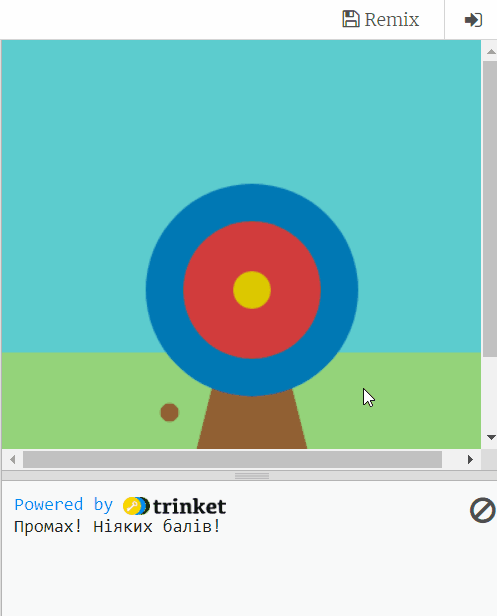
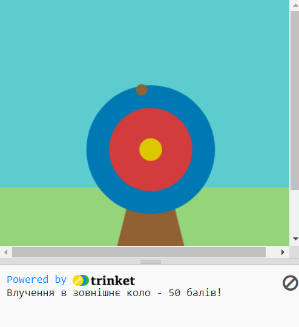
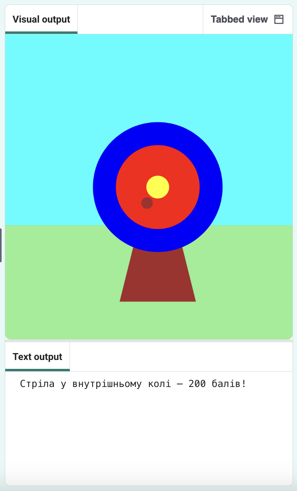

## Набирай бали

Гра буде нараховувати бали залежно від того, чи влучить стріла в ціль.

{:width="300px"}

We use  conditions all the time to make decisions. We could say 'if the pencil is blunt, then sharpen it'. Similarly, `if` conditions let us write code that do something different depending on whether a condition is true or false.

### Відображення балів

--- task ---

Delete ❌ the `print('🎯')` line of code.

--- code ---
---
def draw():
line_highlights: 28
---
# Things to do in every frame
def mouse_pressed():

--- /code ---

--- /task ---

Ми завжди використовуємо  умови, щоб приймати рішення. Скажімо так: "Якщо олівець затупився, його треба нагострити". Аналогічно, умови `if` дозволяють писати код, який виконує різні дії в залежності від того, чи умова істинна або хибна.

--- task ---

Видали ❌ рядок коду `print( red(hit_color), green(hit_color), blue(hit_color) )`.

Notice 👀 that the code uses two equals signs `==` to mean **equal to**.

--- code ---
---
language: python filename: main.py - mouse_pressed() line_numbers: true line_number_start: 5
line_highlights: 9
---

# Функція mouse_pressed викликається тут
def mouse_pressed():     
if hit_colour == Color('blue').hex:  # Like the code in functions, the code in 'if' statements is indented print('You hit the outer circle, 50 points!')

--- /code ---

**Tip:** 💡 If you changed the colour of your outer circle then you will need to replace `'blue'` with the colour name that you have chosen.

--- /task ---

--- task ---

**Test:** 🔄 Run your project. Try to fire the arrow on the blue outer circle to see the message.

**Tip:** 💡 `frame_rate=2`, in `run` at the bottom of your code, controls how fast your game draws. If it's going too fast, set it to a lower number.

**Debug:** 🐞 Check that you have used the American spelling of 'Color' (without a 'u') and that 'Color' is capitalised.

**Debug:** 🐞 Make sure your code matches exactly and you indented the code inside your `if` statement.

**Debug:** 🐞 Make sure that you have entered the correct colour name you used for **your** outer circle.

--- /task ---

`elif` (else - if) can be used to add more conditions to your `if` statement. These will be read from top to bottom. As soon as a **True** condition is found, it will be actioned. Any remaining conditions will be ignored.

--- task ---

**Налагодження:** 🐞 Переконайся, що твій код точно збігається з кодом, і не забудь про відступ всередині оператора `if`.

--- code ---
---
language: python filename: main.py - mouse_pressed() line_numbers: true line_number_start: 6
line_highlights: 9, 10
---

def mouse_pressed(): if hit_colour == Color('blue').hex:   
print('You hit the outer circle, 50 points!') elif hit_colour == Color('red').hex: print('You hit the inner circle, 200 points!') elif hit_colour == Color('yellow').hex: print('You hit the middle, 500 points!')

--- /code ---

--- /task ---

--- task ---

**Test:** 🔄 Run your project. Try to fire the arrow on the inner and middle circles to see their messages.

**Debug:** 🐞 Check your indentation matches the example.

**Debug:** 🐞 If you see a message about `hit_colour` being 'not defined', then go back to `draw()` and check that the line declares `hit_colour` as a global variable.

**Debug:** 🐞 Make sure that you have entered the correct colour name for **your** circles.

**Debug:** 🐞 Make sure that you have used the `.hex` string for **your** circle colours.

--- /task ---

### Мимо мішені

There is one more decision you need to make: what happens if the arrow does not land on any of the target circles? ❌

To do this last check, you use `else`.

--- task ---

Щоб зробити це, скористайся `else`.

--- code ---
---
Додай код, щоб зробити `print` повідомлення `else`, якщо не було виконано ні одного оператора `if` або `elif`.
line_highlights: 11, 12, 13, 14
---

def mouse_pressed(): if hit_colour == Color('blue').hex:   
print('You hit the outer circle, 50 points!') elif hit_colour == Color('red').hex: print('You hit the inner circle, 200 points!') elif hit_colour == Color('yellow').hex: print('You hit the middle, 500 points!') else:   
print('You missed! No points!')

--- /code ---

--- /task ---

--- task ---

**Test:** 🔄 Run your project. Fire the arrow in the grass or sky to see the miss message.

**Choose:** 💭 Change the number of points scored for the different colours.

--- /task ---

**Обирай:** 💭 Змінюй число балів, які нараховуються за різні кольори, як захочеш.
