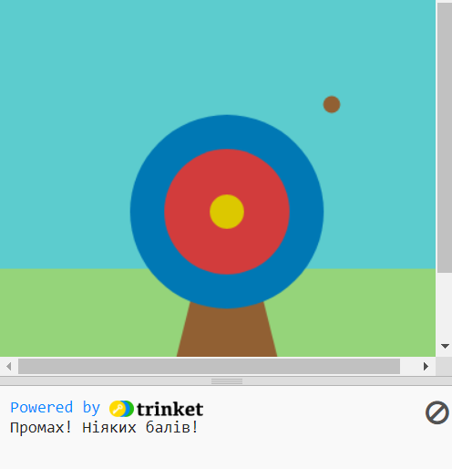

## Набирай бали

Гра буде нараховувати бали залежно від того, чи влучить стріла в ціль.

{:width="300px"}

--- task ---

Перейди до функції `draw()` та додай до списку глобальних змінних `, outer, inner, middle`.

--- code ---
---
language: python
filename: main.py
line_numbers: true
line_number_start: 26
line_highlights: 28
---

def draw():    
# Things to do in every frame    
  global wood, outer, inner, middle    
  sky = color(92, 204, 206) # Червоний = 92, Зелений = 204, Синій = 206    
  grass = color(149, 212, 122)    
  wood = color(145, 96, 51)    
  outer = color(0, 120, 180)    
  inner = color(210, 60, 60)   
  middle = color(220, 200, 0)   

--- /code ---

--- /task ---

Ми завжди використовуємо  умови, щоб приймати рішення. Скажімо так: "Якщо олівець затупився, його треба нагострити". Аналогічно, умови `if` дозволяють писати код, який виконує різні дії в залежності від того, чи умова істинна або хибна.

### Відображення балів

--- task ---

Видали ❌ рядок коду `print( red(hit_color), green(hit_color), blue(hit_color) )`.

--- code ---
---
language: python
filename: main.py - mouse_pressed()
line_numbers: true
line_number_start: 7
line_highlights: 9
---
# Функція mouse_pressed викликається тут    
def mouse_pressed():  

--- /code ---

--- /task ---

--- task ---

Код `print` виведе повідомлення, `if` якщо `hit_color` дорівнює `outer` 🎯.

Зверни увагу 👀, що в коді використовуються два символи дорівнювання `==`, що означатиме **дорівнює**.

--- code ---
---
language: python
filename: main.py - mouse_pressed()
line_numbers: true
line_number_start: 7
line_highlights: 9, 10
---

# Функція mouse_pressed викликається тут     
def mouse_pressed():     
  if hit_color == outer:      
    print('Влучення в зовнішнє коло - 50 балів!') # Подібно до функцій, оператори 'if' починаються з абзацного відступу    

--- /code ---

--- /task ---

--- task ---

**Тест:** 🔄 Запусти свій проєкт. Спробуй зафіксувати стрілу на синьому зовнішньому колі, щоб побачити, як виглядає повідомлення.

**Порада:** 💡 `frame_rate()`, у `setup`, контролює швидкість подій у твоїй грі. Якщо швидкість занадто висока, встанови меншу цифру.

**Налагодження:** 🐞 Переконайся, що твій код точно збігається з кодом, і не забудь про відступ всередині оператора `if`.

--- /task ---

`elif` (else - if) використовується для додавання додаткових умов до оператора `if`. Вони будуть виконуватися зверху вниз. Вона буде виконуватися, як тільки буде виконана умова **True**. А решта умов будуть проігноровані.

--- task ---

Заробляй бали, коли стріла влучає в коло 🎯 `inner` або `middle`:

--- code ---
---
language: python
filename: main.py - mouse_pressed()
line_numbers: true
line_number_start: 8
line_highlights: 11, 12, 13, 14
---

def mouse_pressed():    
  if hit_color == outer:    
    print('Влучення в зовнішнє коло - 50 балів!')    
  elif hit_color == inner:    
    print('Влучення в внутрішнє коло - 200 балів!')   
  elif hit_color == middle:    
    print('Влучення в центр - 500 балів!')    

--- /code ---

--- /task ---

--- task ---

**Тест:** 🔄 Запусти свій проєкт. Спробуй влучити стрілою у внутрішнє та внутрішнє коло, щоб побачити повідомлення.

**Налагодження:** 🐞 Перевір, чи правильно зроблено відступ, як у прикладі.

**Налагодження:** 🐞 Якщо ти бачиш повідомлення, що `inner` або `middle` "не визначено", то повернись до `draw()` та перевір, що вони знаходяться в рядку, який визначає змінні як глобальні.

--- /task ---

### Мимо мішені

Треба вирішити: що буде, якщо стріла не влучить у мішень? ❌

Щоб зробити це, скористайся `else`.

--- task ---

Додай код, щоб зробити `print` повідомлення `else`, якщо не було виконано ні одного оператора `if` або `elif`.

--- code ---
---
language: python
filename: main.py
line_numbers: true
line_number_start: 8
line_highlights: 15, 16
---

def mouse_pressed():    
  if hit_color == outer:   
    print('Влучення в зовнішнє коло - 50 балів!')   
  elif hit_color == inner:   
    print('Влучення в внутрішнє коло - 200 балів!')   
  elif hit_color == middle:    
    print('Влучення в центр - 500 балів!')   
  else:   
    print('Промах! Ніяких балів!')    

--- /code ---

--- /task ---

--- task ---

**Тест:** 🔄 Запусти свій проєкт. Спробуй зафіксувати стрілу в траві або на небі, щоб побачити повідомлення про промах.

**Обирай:** 💭 Змінюй число балів, які нараховуються за різні кольори, як захочеш.

--- /task ---

