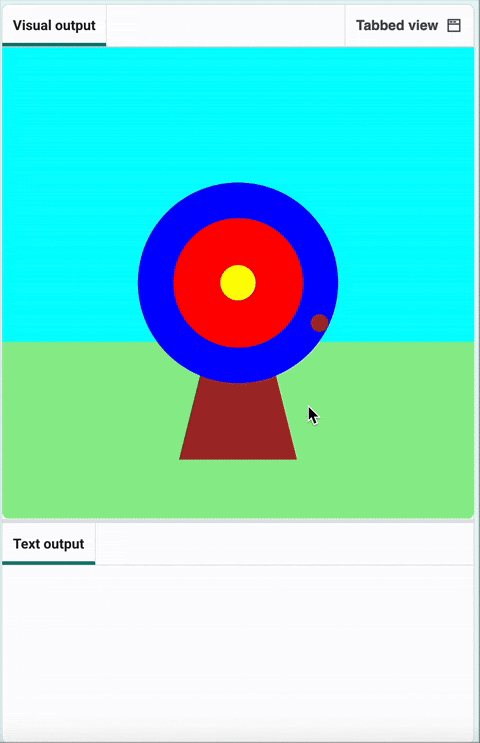
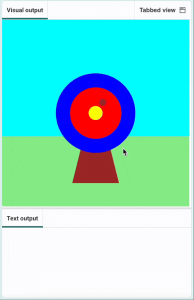

## Набирай бали

Додай рахунок залежно від того, куди влучить стріла.

{:width="300px"}

--- task ---

Додай символ коментаря # перед рядком, який виводить 🎯, щоб він більше не виконувався.

--- code ---
---
language: python line_numbers: true line_number_start: 6
line_highlights: 7
---
def mouse_pressed(): # print('🎯')

--- /code ---

--- /task ---

--- task ---

Виведи повідомлення, **якщо** колір `hit_colour`{:.language-python} дорівнює кольору `зовнішнього` кола (синьому).

--- code ---
---
language: python line_numbers: true line_number_start: 6
line_highlights: 8-9
---
def mouse_pressed():    
# print('🎯') if hit_colour == Color('blue').hex: print('You hit the outer circle, 50 points!')

--- /code ---

**Порада:** якщо твоє зовнішнє коло іншого кольору, тобі потрібно буде замінити `blue` на назву вибраного тобою кольору англійською мовою.

--- /task ---

--- task ---

**Протестуй:** натисни на кнопку **Run**. Зачекай, поки стріла опиниться на синьому колі, а потім натисни ліву кнопку миші. 

--- /task ---

Щоб додати більше умов до виразу `if`{:.language-python}, можна використовувати `elif`{:.language-python}.

--- task ---

Додай рядки коду, які рахуватимуть бали у випадку потрапляння у **внутрішнє** або **середнє** коло.

--- code ---
---
language: python line_numbers: true line_number_start: 6
line_highlights: 10-14
---

def mouse_pressed(): # print('🎯') if hit_colour == Color('blue').hex: print('You hit the outer circle, 50 points!') elif hit_colour == Color('red').hex: print('You hit the inner circle, 200 points!') elif hit_colour == Color('yellow').hex: print('You hit the middle, 500 points!')

--- /code ---

--- /task ---

--- task ---

**Протестуй:** натисни кнопку **Run**. Ти маєш бачити рахунок щоразу, як стріла влучає у мішень.

--- /task ---

### Мимо мішені

Тобі треба вирішити: що буде, якщо стріла не влучить у мішень?

Щоб виконати цю перевірку, використай `else`{:.language-python}.

--- task ---

Додай код, який виводитиме повідомлення (`print`), коли жодна з умов `if` або `elif` не виконалась.

--- code ---
---
language: python line_numbers: true line_number_start: 12
line_highlights: 14-15
---

    elif hit_colour == Color('yellow').hex:
        print('You hit the middle, 500 points!')
    else:   
        print('You missed! No points!')

--- /code ---

--- /task ---

--- task ---

**Протестуй:** натисни на кнопку **Run**. Спробуй влучити в траву або небо, щоб побачити повідомлення про промах.

--- /task ---

--- save ---
