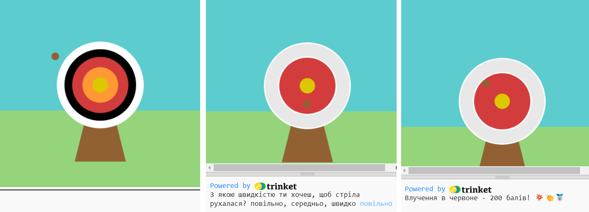

## Вдосконалення твого проєкту

Персоналізуй та додай більше до свого проєкту. Можливо, ти захочеш збільшити складність влучення, або додати більше кружечків до своєї мішені.

{:width="300px"}

--- task ---

Ти можеш:

+ Додати додатково коло `fourth` та `fifth`, у нових кольорах, які будуть давати різну кількість балів в залежності від свого розташування 🟠🟣
+ Додати емодзі до повідомлень ([список емодзі](https://unicode.org/emoji/charts/full-emoji-list.html){:target="_blank"}, які можна скопіювати та використати) 🎯
+ Зробити гру легшою або складнішою, змінивши значення `frame_rate(2)` 💨
+ Скористатися `input()`, щоб запитати користувача, на якому рівні складності він хоче зіграти 🗣️

--- /task ---

--- collapse ---
---
title: Завершений проєкт
---

Ти можеш переглянути [завершений проєкт тут](https://trinket.io/python/8444210ec1){:target="_blank"}.

--- /collapse ---

